<h1 align="center">Lazar Sazdov</h1>

  <b>Backend Engineer @ <a href="https://ominimo.com">Ominimo</a></b> 
  Software Engineering student @ FTN Novi Sad

  

## 🌲 About me

  

- 🌿 I like problems where correctness is the whole point: concurrent backends, on-chain rules that can't be talked out of, ML experiments that report the result even when the hypothesis loses.
- ⚔️ **Competitive programming** keeps me sharp between projects.
- 🌱 Half the repos below were grown together with my brother [Milan](https://github.com/MilanSazdov).

## 🧰 Tech I reach for

  
   
  
   
  

## 🏆 Trophy shelf

| | Project | Where |
|---|---|---|
| 🥇 | [Melody Bond](https://github.com/MilanSazdov/Melody-Bond) | 1st place, DeFi Everywhere hackathon |
| 🥇 | [5 dana u oblacima 2025](https://github.com/LazarSazdov/5-dana-u-oblacima-2025-challenge) | 1st place in the finals with my team, Levi9 |
| 🥇 | [Insurance Premium Prediction](https://github.com/LazarSazdov/MATF-SUMA) | 1st place in qualifications, 6th in finals, MATF SUMA |
| 🥈 | [Auto Code Walker](https://github.com/LazarSazdov/JB-plugin) | 2nd place, JetBrains hackathon |

## 🌳 The tall trees

  
  
  
  
  
  

## 🍃 The rest of the forest

<b>⛓️ Blockchain and zero-knowledge</b>

 

| Project | What it does | Stack |
|---|---|---|
| [Melody Bond](https://github.com/MilanSazdov/Melody-Bond) | Fans become the record label. Fund an artist, get shares in a Real World Asset NFT, govern it through a per-song DAO and collect royalties from a treasury that lives inside the NFT itself. Investing and voting are fully gasless. | Solidity, Foundry, ERC-4337, ERC-6551, Next.js, viem |
| [Decentralized Whistleblower](https://github.com/LazarSazdov/Decentralized-ML-Whistleblower-ZK-Email-) | Anonymous corporate whistleblowing. Prove you work at a company from a DKIM-signed email with a Groth16 proof, publish a PII-redacted report on-chain, and stay unidentifiable. One report per person per month, enforced by Poseidon nullifiers. Advanced ZKP project for the ZK Proofs course at Matematička Akademija. | Circom, snarkjs, Solidity, Hardhat, Next.js, IPFS |
| [Bouncer](https://github.com/LazarSazdov/web3-petnica-frontier) | Lets an AI agent trade on Ethereum without being able to hurt you. The agent proposes, a smart-account guard hook decides: whitelists, spend caps, allowed selectors, timelocked loosening. A prompt-injected agent can ask for anything and still get nothing. Built at the Petnica Research Station Web3 camp. | Solidity, Foundry, TypeScript, MCP, Uniswap v3 |
| Sui dApps | Four small Move dApps with sponsored transactions: [tip jar](https://github.com/LazarSazdov/sui-tipjar-dapp), [guestbook](https://github.com/LazarSazdov/sui-guestbook-dapp), [faucet](https://github.com/LazarSazdov/sui-faucet-dapp), [voting](https://github.com/LazarSazdov/sui-voting-dapp). | Move, React, TypeScript, Enoki |

<b>🧠 Machine learning</b>

 

| Project | What it does | Stack |
|---|---|---|
| [MARL Dynamic Pricing](https://github.com/LazarSazdov/marl-dqn-dynamic-pricing) | Do independent pricing bots learn to form a cartel? DQN, PPO and tabular Q agents price real Airbnb listings in a demand model learned from Inside Airbnb data. 120 runs, collusion measured against computed Nash and monopoly bounds. Spoiler: mostly no, except PPO. | Python, PyTorch, Gymnasium, PettingZoo |
| [Insurance Premium Prediction](https://github.com/LazarSazdov/MATF-SUMA) | Per-insurer stacking ensemble pricing car insurance for 11 insurers. Out-of-fold target encoding, K-Means geographic risk zones, recency-weighted training so the models care more about last week than last month. | Python, LightGBM, XGBoost, CatBoost |

<b>⚙️ Backend and systems</b>

 

| Project | What it does | Stack |
|---|---|---|
| [Lucky3](https://github.com/kzi-nastava/mrs-team27-Lucky3) | Full ride-hailing platform: passengers, drivers, live ride tracking over WebSockets, panic button, reviews, support chat, push notifications, and an Android app to go with the web one. University team project with a real amount of code in it. | Spring Boot, PostgreSQL, Angular, Android, JWT, Firebase |
| [Chaotic Cupid](https://github.com/LazarSazdov/Cupid---ASP.NET-PubSub) | Pub/sub matchmaking over SignalR. A hub server, a Cupid service that fires off matching rounds on a timer, and interactive clients, all in containers. | C#, ASP.NET Core, SignalR, Docker Compose |
| [Industrial Processing System](https://github.com/LazarSazdov/Industrial-Processsing-System-C-) | A job engine that refuses to deadlock: bounded priority queue, worker pool, producers, retries, async job handles, events and periodic reports, configured from XML. | C#, .NET |
| [Student Canteen Reservations](https://github.com/LazarSazdov/5-dana-u-oblacima-2025-challenge) | REST API for canteen bookings with capacity and working-hours rules. This was the qualification task for the Levi9 "5 dana u oblacima 2025" challenge, and my team went on to win 1st place in the finals. 112 unit tests, because overbooking a canteen is a serious matter. | Node.js, TypeScript, Express, Jest |
| [Pijaca Plus](https://github.com/LazarSazdov/PiazzaPlus) | Mobile app for Serbian farmers' markets. Buyers reserve produce and scan receipts, sellers post ads by voice, get surplus predictions and donate what's left. | React Native, Expo, Express, Prisma |

<b>🔧 Tooling and toys</b>

 

| Project | What it does | Stack |
|---|---|---|
| [Auto Code Walker](https://github.com/LazarSazdov/JB-plugin) | IntelliJ IDEA plugin that turns onboarding into a guided tour through the codebase, with AI filling in the narration. | Java, IntelliJ Platform SDK, Gradle |
| [Cipher Zodiac](https://github.com/LazarSazdov/cipher-zodiac) | Homophonic substitution cipher in the browser. Watch the letter frequency chart go flat as the cipher hides the usual E and T spikes. | JavaScript |

## 📊 Growth rings

  
  

  

  

  <picture>
    <source media="(prefers-color-scheme: dark)" srcset="https://raw.githubusercontent.com/LazarSazdov/LazarSazdov/output/github-snake-dark.svg"/>
    
  </picture>

